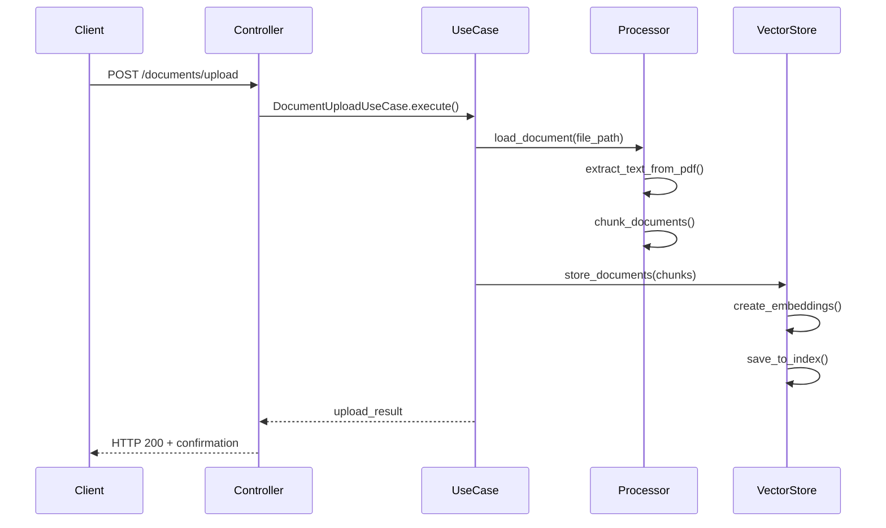
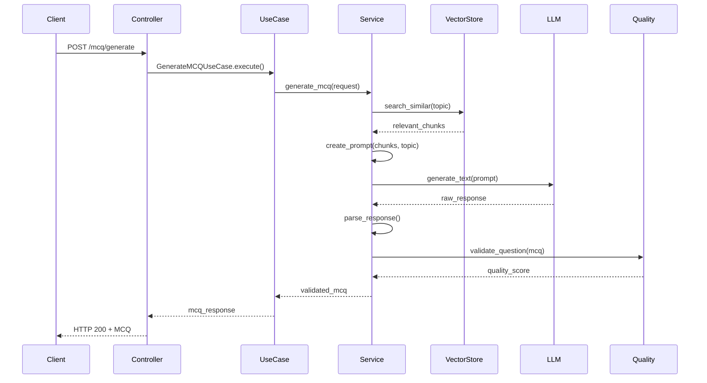
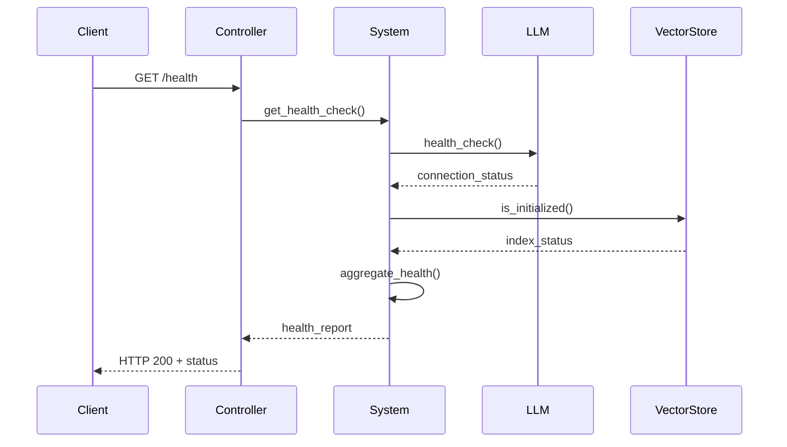

# 📚 RAG MCQ System - Complete Software Documentation

> **Comprehensive Guide**: Understanding the Clean Architecture implementation, code workflow, and testing procedures for the RAG-based Multiple Choice Question generation system.

## 📋 Table of Contents
1. [System Overview](#system-overview)
2. [Architecture Deep Dive](#architecture-deep-dive)
3. [Code Workflow Analysis](#code-workflow-analysis)
4. [File Structure & Components](#file-structure--components)
5. [API Endpoints Documentation](#api-endpoints-documentation)
6. [Testing Guide](#testing-guide)
7. [Development Setup](#development-setup)
8. [Deployment Guide](#deployment-guide)
9. [Troubleshooting](#troubleshooting)

---

## 🎯 System Overview

### What This System Does
The RAG MCQ System is an AI-powered application that generates multiple-choice questions from PDF documents using:
- **Document Processing**: Extracts and chunks PDF content
- **Vector Search**: Finds relevant content using semantic similarity
- **AI Generation**: Creates questions using Together AI API
- **Quality Control**: Validates and scores generated questions

### Key Technologies
- **FastAPI**: Modern web framework for APIs
- **Together AI**: Large Language Model API for question generation
- **FAISS**: Vector database for semantic search
- **LangChain**: Document processing and chunking
- **Pydantic**: Data validation and serialization
- **Async/Await**: Non-blocking operations

### System Capabilities
- Upload and process PDF documents
- Generate single or batch MCQ questions
- Multiple question types (single choice, multiple choice, true/false)
- Difficulty levels (easy, medium, hard)
- Real-time health monitoring
- Structured logging and error handling

---

## 🏗️ Architecture Deep Dive

### Clean Architecture Principles

Our system follows Clean Architecture with 4 distinct layers:

```
┌─────────────────────────────────────────┐
│           🌐 PRESENTATION               │
│        (Controllers, Routes)            │
├─────────────────────────────────────────┤
│           📋 APPLICATION                │
│        (Use Cases, DTOs)                │
├─────────────────────────────────────────┤
│             🧠 DOMAIN                   │
│     (Entities, Services, Interfaces)    │
├─────────────────────────────────────────┤
│          🔧 INFRASTRUCTURE              │
│    (External APIs, Databases, Files)    │
└─────────────────────────────────────────┘
```

### Layer Responsibilities

#### 1. Presentation Layer 🌐
- **Purpose**: Handle HTTP requests/responses
- **Components**: Controllers, route handlers
- **Responsibilities**:
  - Validate input data
  - Call appropriate use cases
  - Format responses
  - Handle HTTP errors

#### 2. Application Layer 📋
- **Purpose**: Orchestrate business workflows
- **Components**: Use cases, DTOs
- **Responsibilities**:
  - Define application workflows
  - Coordinate between domain services
  - Transform data between layers
  - Handle application-specific logic

#### 3. Domain Layer 🧠
- **Purpose**: Core business logic
- **Components**: Entities, services, repository interfaces
- **Responsibilities**:
  - Define business rules
  - Implement core algorithms
  - Validate business constraints
  - Define data contracts

#### 4. Infrastructure Layer 🔧
- **Purpose**: External system integration
- **Components**: API clients, database implementations, file processors
- **Responsibilities**:
  - Connect to external APIs
  - Handle file operations
  - Implement data persistence
  - Manage external dependencies

### Dependency Flow

```
Presentation → Application → Domain ← Infrastructure
```

- **Inward Dependencies**: Each layer only depends on inner layers
- **Interface Segregation**: Infrastructure implements domain interfaces
- **Dependency Inversion**: High-level modules don't depend on low-level details

---

## 🔄 Code Workflow Analysis

### 1. Document Upload Workflow



**Step-by-Step Process:**
1. Client uploads PDF file
2. Document controller validates file type and size
3. PDF processor extracts text and creates chunks
4. Vector store generates embeddings for each chunk
5. Chunks are stored in FAISS index
6. Background processing status returned to client

### 2. MCQ Generation Workflow



**Step-by-Step Process:**
1. Client requests MCQ generation with topic and parameters
2. Vector store searches for relevant document chunks
3. MCQ service creates intelligent prompt with context
4. Together AI generates question and options
5. Response is parsed and structured
6. Quality service validates the question
7. Final MCQ is returned to client

### 3. Health Check Workflow



---

## 📁 File Structure & Components

### Complete Project Structure

```
app/
├── 🚀 Entry Points
│   ├── main.py                 # FastAPI application entry point
│   ├── app_clean.py           # Alternative clean implementation
│   └── requirements.txt       # Python dependencies
│
├── ⚙️ Configuration
│   └── config/
│       └── settings.py        # Environment-based configuration
│
├── 📋 Application Layer
│   └── Application/
│       ├── dto/               # Data Transfer Objects
│       │   ├── request_dto.py # Input validation models
│       │   └── response_dto.py# Output formatting models
│       └── use_cases/         # Business workflows
│           ├── generate_mcq_use_case.py
│           └── batch_generate_mcq_use_case.py
│
├── 🧠 Domain Layer
│   └── Domain/
│       ├── entities/          # Core business objects
│       │   ├── mcq_question.py# Question data model
│       │   ├── document.py    # Document data model
│       │   └── enums.py       # Type definitions
│       ├── repositories/      # Data access interfaces
│       │   ├── llm_repository.py
│       │   ├── vector_store_repository.py
│       │   └── document_repository.py
│       └── services/          # Business logic
│           ├── mcq_generation_service.py
│           ├── quality_validation_service.py
│           └── difficulty_analysis_service.py
│
├── 🔧 Infrastructure Layer
│   └── Infrastructure/
│       ├── llm/               # AI service implementations
│       │   ├── together_ai_client.py
│       │   └── llm_factory.py
│       ├── vector_stores/     # Vector database
│       │   └── faiss_store.py
│       └── document_processing/# File processing
│           └── pdf_processor.py
│
├── 🌐 Presentation Layer
│   └── Presentation/
│       └── controllers/       # HTTP request handlers
│           ├── mcq_controller.py
│           ├── document_controller.py
│           └── system_controller.py
│
├── 📄 Data & Documentation
│   ├── pdfs/                  # Sample documents
│   ├── SOFTWARE_DOCUMENTATION.md
│   ├── MIGRATION_README.md
│   └── .dockerignore
```

### Key Files Detailed Analysis

#### **main.py** - Application Bootstrap
```python
# Main responsibilities:
# 1. Application lifecycle management
# 2. Dependency injection setup
# 3. Route registration
# 4. Middleware configuration
# 5. Error handling setup

Key Functions:
- initialize_services(): Sets up all dependencies
- create_app(): Configures FastAPI instance
- lifespan(): Manages startup/shutdown
```

#### **config/settings.py** - Configuration Management
```python
# Centralized configuration with environment variables
# Features:
# - Type-safe settings with Pydantic
# - Environment-based configuration
# - Secure secret management
# - Validation and defaults

Settings Categories:
- API settings (host, port, debug)
- LLM settings (provider, model, API keys)
- Embedding settings (model, chunk size)
- Vector store settings (type, thresholds)
- Quality settings (scoring thresholds)
```

#### **Domain/entities/mcq_question.py** - Core Data Model
```python
class MCQQuestion:
    # Represents a complete MCQ with validation
    question_text: str
    options: List[MCQOption]
    correct_answer_index: int
    difficulty: DifficultyLevel
    metadata: Dict[str, Any]

    # Business rules and validation
    def validate(self) -> bool
    def calculate_quality_score(self) -> float
```

#### **Infrastructure/llm/together_ai_client.py** - AI Integration
```python
class TogetherAIClient:
    # Async HTTP client for Together AI
    # Features:
    # - Retry logic with exponential backoff
    # - Error handling and timeout management
    # - Rate limiting awareness
    # - Health check capabilities

    async def generate_text(prompt: str) -> str
    async def health_check() -> bool
```

---

## 🌐 API Endpoints Documentation

### Base URL
```
http://localhost:8000
```

### Authentication
Currently, the API does not require authentication. All endpoints are publicly accessible.

### Content Type
All requests should use `Content-Type: application/json`

### Response Format
All responses follow this structure:
```json
{
  "data": {},      // Success data
  "error": "",     // Error message (if any)
  "timestamp": "", // ISO timestamp
  "version": "1.0" // API version
}
```

### Endpoints Overview

#### 1. Health & System Information

##### GET `/health`
**Purpose**: Check system health status
**Response**: Health check with component status

```json
{
  "status": "healthy",
  "timestamp": "2024-01-15T10:30:00Z",
  "services": {
    "llm_service": true,
    "vector_store": true,
    "document_processor": true
  },
  "version": "1.0.0",
  "uptime_seconds": 3600
}
```

##### GET `/api/v1/system/info`
**Purpose**: Get comprehensive system information
**Response**: System configuration and statistics

```json
{
  "system": "RAG MCQ Generation API",
  "version": "1.0.0",
  "architecture": "Clean Architecture",
  "environment": "development",
  "components": {
    "llm_provider": "together_ai",
    "llm_model": "meta-llama/Llama-2-7b-chat-hf",
    "embedding_model": "bkai-foundation-models/vietnamese-bi-encoder",
    "vector_store": "faiss"
  },
  "vector_store_documents": 42
}
```

#### 2. Document Management

##### POST `/api/v1/documents/upload`
**Purpose**: Upload and process PDF documents
**Content-Type**: `multipart/form-data`
**Parameters**:
- `file`: PDF file (required)

**Request Example**:
```bash
curl -X POST "http://localhost:8000/api/v1/documents/upload" \
  -F "file=@document.pdf"
```

**Response**:
```json
{
  "message": "Document uploaded successfully",
  "filename": "document.pdf",
  "file_size": 1048576,
  "processing": "started in background",
  "upload_time": 1642248600.0
}
```

##### GET `/api/v1/documents/stats`
**Purpose**: Get document processing statistics
**Response**: Document and vector store statistics

```json
{
  "is_initialized": true,
  "embedding_model": "bkai-foundation-models/vietnamese-bi-encoder",
  "document_count": 42
}
```

#### 3. MCQ Generation

##### POST `/api/v1/mcq/generate`
**Purpose**: Generate a single MCQ question
**Content-Type**: `application/json`

**Request Body**:
```json
{
  "topic": "Machine Learning",
  "context": "Optional background context...",
  "question_type": "single_choice",
  "difficulty": "medium",
  "num_options": 4,
  "language": "en"
}
```

**Request Parameters**:
- `topic` (string, required): Topic for question generation
- `context` (string, optional): Additional context for question
- `question_type` (enum, optional): `single_choice`, `multiple_choice`, `true_false`
- `difficulty` (enum, optional): `easy`, `medium`, `hard`
- `num_options` (integer, optional): Number of answer choices (2-6)
- `language` (string, optional): Language code (default: "en")

**Response**:
```json
{
  "question": "What is the primary goal of machine learning?",
  "options": [
    "To replace human intelligence completely",
    "To enable computers to learn from data without explicit programming",
    "To create faster computers",
    "To reduce computational costs"
  ],
  "correct_answer": "To enable computers to learn from data without explicit programming",
  "correct_answer_index": 1,
  "difficulty": "medium",
  "question_type": "single_choice",
  "metadata": {
    "generation_time": 2.5,
    "quality_score": 85.2,
    "source_chunks": 3,
    "confidence": 0.92
  }
}
```

##### POST `/api/v1/mcq/generate-batch`
**Purpose**: Generate multiple MCQ questions
**Content-Type**: `application/json`

**Request Body**:
```json
{
  "topic": "Python Programming",
  "context": "Python basics and data structures",
  "question_type": "single_choice",
  "difficulty": "medium",
  "num_options": 4,
  "count": 5,
  "ensure_variety": true
}
```

**Additional Parameters**:
- `count` (integer, required): Number of questions to generate (1-50)
- `ensure_variety` (boolean, optional): Ensure diverse question types

**Response**:
```json
{
  "questions": [
    {
      "question": "...",
      "options": ["...", "...", "...", "..."],
      "correct_answer": "...",
      "correct_answer_index": 1,
      "difficulty": "medium",
      "question_type": "single_choice",
      "metadata": {...}
    }
  ],
  "summary": {
    "total_requested": 5,
    "total_generated": 5,
    "average_quality_score": 82.4,
    "average_generation_time": 2.1,
    "difficulty_distribution": {
      "easy": 1,
      "medium": 3,
      "hard": 1
    }
  }
}
```

### Error Responses

#### 400 Bad Request
```json
{
  "error": "ValueError",
  "message": "Topic must be at least 3 characters long",
  "timestamp": "2024-01-15T10:30:00Z"
}
```

#### 500 Internal Server Error
```json
{
  "error": "RuntimeError",
  "message": "LLM service temporarily unavailable",
  "timestamp": "2024-01-15T10:30:00Z"
}
```

#### 503 Service Unavailable
```json
{
  "error": "ServiceUnavailable",
  "message": "System initialization in progress",
  "timestamp": "2024-01-15T10:30:00Z"
}
```

---

## 🧪 Testing Guide

### Prerequisites

1. **Python Environment**: Python 3.8+
2. **Dependencies**: Install requirements
3. **API Keys**: Together AI API key
4. **Test Data**: Sample PDF documents

### Setup Testing Environment

#### 1. Install Dependencies
```bash
# Navigate to project directory
cd app/

# Install dependencies
pip install -r requirements.txt

# Install additional testing dependencies
pip install pytest pytest-asyncio httpx
```

#### 2. Environment Configuration
```bash
# Create environment file
cp .env.example .env

# Set required environment variables
export TOGETHER_API_KEY="your_api_key_here"
export ENVIRONMENT="testing"
export LOG_LEVEL="DEBUG"
```

#### 3. Prepare Test Data
```bash
# Ensure test PDFs are available
ls pdfs/
# Should show: Project_2_2_SpamClassifier_AIOTimeSeries.pdf
```

### Running the Application

#### 1. Development Mode
```bash
# Start the development server
python main.py

# Alternative with uvicorn directly
uvicorn main:app --host 0.0.0.0 --port 8000 --reload
```

#### 2. Production Mode
```bash
# Set production environment
export ENVIRONMENT="production"
export LOG_LEVEL="INFO"

# Start production server
uvicorn main:app --host 0.0.0.0 --port 8000 --workers 4
```

#### 3. Debug Mode
```bash
# Enable debug logging
export LOG_LEVEL="DEBUG"
export API_DEBUG="true"

# Start with detailed logging
python main.py
```

### Testing Procedures

#### 1. Health Check Tests

**Basic Health Check**:
```bash
# Test system health
curl -X GET "http://localhost:8000/health"

# Expected response: HTTP 200 with health status
```

**System Information**:
```bash
# Get system details
curl -X GET "http://localhost:8000/api/v1/system/info"

# Verify all components are loaded
```

#### 2. Document Upload Tests

**Valid PDF Upload**:
```bash
# Upload a test PDF
curl -X POST "http://localhost:8000/api/v1/documents/upload" \
  -F "file=@pdfs/Project_2_2_SpamClassifier_AIOTimeSeries.pdf"

# Expected: HTTP 200 with upload confirmation
```

**Invalid File Tests**:
```bash
# Test with non-PDF file
curl -X POST "http://localhost:8000/api/v1/documents/upload" \
  -F "file=@README.md"

# Expected: HTTP 400 with error message
```

**Large File Test**:
```bash
# Test file size limits (create large file)
dd if=/dev/zero of=large.pdf bs=1M count=50

curl -X POST "http://localhost:8000/api/v1/documents/upload" \
  -F "file=@large.pdf"

# Expected: HTTP 400 if file too large
```

#### 3. MCQ Generation Tests

**Basic MCQ Generation**:
```bash
# Test single MCQ generation
curl -X POST "http://localhost:8000/api/v1/mcq/generate" \
  -H "Content-Type: application/json" \
  -d '{
    "topic": "Machine Learning",
    "question_type": "single_choice",
    "difficulty": "medium",
    "num_options": 4
  }'

# Expected: HTTP 200 with MCQ response
```

**With Context**:
```bash
# Test with additional context
curl -X POST "http://localhost:8000/api/v1/mcq/generate" \
  -H "Content-Type: application/json" \
  -d '{
    "topic": "Python Programming",
    "context": "Python is a high-level programming language known for its simplicity and readability.",
    "question_type": "single_choice",
    "difficulty": "easy",
    "num_options": 4
  }'
```

**Batch Generation**:
```bash
# Test batch MCQ generation
curl -X POST "http://localhost:8000/api/v1/mcq/generate-batch" \
  -H "Content-Type: application/json" \
  -d '{
    "topic": "Data Structures",
    "question_type": "single_choice",
    "difficulty": "medium",
    "num_options": 4,
    "count": 3
  }'

# Expected: HTTP 200 with multiple questions
```

**Different Question Types**:
```bash
# Test true/false questions
curl -X POST "http://localhost:8000/api/v1/mcq/generate" \
  -H "Content-Type: application/json" \
  -d '{
    "topic": "Programming Concepts",
    "question_type": "true_false",
    "difficulty": "easy"
  }'

# Test multiple choice
curl -X POST "http://localhost:8000/api/v1/mcq/generate" \
  -H "Content-Type: application/json" \
  -d '{
    "topic": "Algorithms",
    "question_type": "multiple_choice",
    "difficulty": "hard",
    "num_options": 5
  }'
```

#### 4. Error Handling Tests

**Invalid Topic**:
```bash
# Test with empty topic
curl -X POST "http://localhost:8000/api/v1/mcq/generate" \
  -H "Content-Type: application/json" \
  -d '{
    "topic": "",
    "question_type": "single_choice"
  }'

# Expected: HTTP 400 with validation error
```

**Invalid Parameters**:
```bash
# Test with invalid difficulty
curl -X POST "http://localhost:8000/api/v1/mcq/generate" \
  -H "Content-Type: application/json" \
  -d '{
    "topic": "Testing",
    "difficulty": "impossible"
  }'

# Expected: HTTP 422 with validation error
```

**Too Many Options**:
```bash
# Test with too many options
curl -X POST "http://localhost:8000/api/v1/mcq/generate" \
  -H "Content-Type: application/json" \
  -d '{
    "topic": "Testing",
    "num_options": 10
  }'

# Expected: HTTP 400 with validation error
```

#### 5. Performance Tests

**Response Time Test**:
```bash
# Measure response times
time curl -X POST "http://localhost:8000/api/v1/mcq/generate" \
  -H "Content-Type: application/json" \
  -d '{
    "topic": "Performance Testing",
    "question_type": "single_choice"
  }'

# Monitor response times (should be < 5 seconds)
```

**Concurrent Requests**:
```bash
# Test multiple concurrent requests
for i in {1..5}; do
  curl -X POST "http://localhost:8000/api/v1/mcq/generate" \
    -H "Content-Type: application/json" \
    -d '{
      "topic": "Concurrent Test '${i}'",
      "question_type": "single_choice"
    }' &
done
wait

# Check all requests complete successfully
```

#### 6. Integration Tests

**Full Workflow Test**:
```bash
#!/bin/bash
# Complete workflow test script

echo "1. Testing health check..."
curl -s -X GET "http://localhost:8000/health" | jq .

echo "2. Uploading document..."
curl -s -X POST "http://localhost:8000/api/v1/documents/upload" \
  -F "file=@pdfs/Project_2_2_SpamClassifier_AIOTimeSeries.pdf" | jq .

echo "3. Waiting for processing..."
sleep 10

echo "4. Generating MCQ..."
curl -s -X POST "http://localhost:8000/api/v1/mcq/generate" \
  -H "Content-Type: application/json" \
  -d '{
    "topic": "Machine Learning",
    "question_type": "single_choice",
    "difficulty": "medium"
  }' | jq .

echo "5. Checking system stats..."
curl -s -X GET "http://localhost:8000/api/v1/system/info" | jq .

echo "Workflow test completed!"
```

### Automated Testing

#### 1. Unit Tests

Create `tests/test_services.py`:
```python
import pytest
from unittest.mock import AsyncMock, Mock
from Domain.services.mcq_generation_service import MCQGenerationService
from Domain.entities.mcq_question import MCQQuestion
from Application.dto.request_dto import MCQRequestDTO

@pytest.mark.asyncio
async def test_mcq_generation():
    # Arrange
    mock_llm = AsyncMock()
    mock_vector_store = AsyncMock()
    mock_quality = Mock()
    mock_difficulty = Mock()

    mock_llm.generate_text.return_value = """
    Question: What is Python?
    A) A programming language
    B) A snake
    C) A tool
    D) A framework
    Answer: A
    """

    mock_vector_store.search_similar.return_value = [
        Mock(content="Python is a programming language...")
    ]

    service = MCQGenerationService(
        mock_llm, mock_vector_store, mock_quality, mock_difficulty
    )

    request = MCQRequestDTO(
        topic="Python",
        question_type="single_choice",
        difficulty="medium"
    )

    # Act
    result = await service.generate_mcq(request)

    # Assert
    assert isinstance(result, MCQQuestion)
    assert "Python" in result.question_text
    assert len(result.options) == 4
    mock_llm.generate_text.assert_called_once()
```

#### 2. Integration Tests

Create `tests/test_api.py`:
```python
import pytest
from fastapi.testclient import TestClient
from main import app

@pytest.fixture
def client():
    return TestClient(app)

def test_health_endpoint(client):
    response = client.get("/health")
    assert response.status_code == 200
    data = response.json()
    assert "status" in data
    assert "services" in data

def test_generate_mcq_endpoint(client):
    response = client.post(
        "/api/v1/mcq/generate",
        json={
            "topic": "Testing",
            "question_type": "single_choice",
            "difficulty": "medium"
        }
    )
    assert response.status_code == 200
    data = response.json()
    assert "question" in data
    assert "options" in data
    assert "correct_answer" in data

def test_invalid_mcq_request(client):
    response = client.post(
        "/api/v1/mcq/generate",
        json={
            "topic": "",  # Invalid empty topic
            "question_type": "single_choice"
        }
    )
    assert response.status_code == 400
```

#### 3. Running Tests

```bash
# Run all tests
pytest tests/ -v

# Run specific test file
pytest tests/test_services.py -v

# Run with coverage
pytest tests/ --cov=. --cov-report=html

# Run integration tests only
pytest tests/test_api.py -v -k "integration"
```

### Performance Monitoring

#### 1. Resource Usage
```bash
# Monitor CPU and memory usage
top -p $(pgrep -f "main.py")

# Or use htop for better visualization
htop -p $(pgrep -f "main.py")
```

#### 2. API Response Times
```bash
# Use wrk for load testing
wrk -t4 -c100 -d30s --timeout 30s \
  -s post.lua \
  http://localhost:8000/api/v1/mcq/generate

# post.lua script:
# wrk.method = "POST"
# wrk.body = '{"topic":"Load Test","question_type":"single_choice"}'
# wrk.headers["Content-Type"] = "application/json"
```

#### 3. Application Logs
```bash
# Monitor application logs
tail -f logs/app.log

# Filter for errors
grep "ERROR" logs/app.log

# Monitor real-time requests
grep "MCQ generated" logs/app.log
```

### Troubleshooting Tests

#### Common Issues and Solutions

**1. Service Not Starting**:
```bash
# Check if port is already in use
lsof -i :8000

# Check environment variables
env | grep -E "(TOGETHER_API_KEY|ENVIRONMENT)"

# Check Python path
python -c "import sys; print(sys.path)"
```

**2. API Key Issues**:
```bash
# Verify API key is set
echo $TOGETHER_API_KEY

# Test API key manually
curl -H "Authorization: Bearer $TOGETHER_API_KEY" \
  https://api.together.xyz/models
```

**3. Vector Store Issues**:
```bash
# Check if documents are loaded
curl "http://localhost:8000/api/v1/documents/stats"

# Upload test document if needed
curl -X POST "http://localhost:8000/api/v1/documents/upload" \
  -F "file=@pdfs/Project_2_2_SpamClassifier_AIOTimeSeries.pdf"
```

**4. Memory Issues**:
```bash
# Check memory usage
free -h

# Monitor memory during operation
watch -n 1 'free -h && ps aux | grep python'
```

### Test Results Validation

#### Expected Performance Metrics:
- **Health Check**: < 100ms response time
- **Document Upload**: < 5 seconds for 10MB PDF
- **MCQ Generation**: < 10 seconds per question
- **Memory Usage**: < 2GB during normal operation
- **CPU Usage**: < 50% during generation

#### Quality Metrics:
- **MCQ Quality Score**: > 70/100
- **Question Relevance**: Manual review required
- **Answer Accuracy**: Manual verification needed
- **Variety in Questions**: Different question patterns

---

## 🚀 Development Setup

### Prerequisites
- Python 3.8+
- Git
- Code editor (VS Code recommended)
- Terminal/Command prompt

### Environment Setup

#### 1. Clone Repository
```bash
git clone https://github.com/MathematicGuy/RAG-for-Multiple-Choice-Question-Generation.git
cd RAG-for-Multiple-Choice-Question-Generation/app
```

#### 2. Create Virtual Environment
```bash
# Create virtual environment
python -m venv venv

# Activate virtual environment
# On Windows:
venv\Scripts\activate
# On macOS/Linux:
source venv/bin/activate
```

#### 3. Install Dependencies
```bash
# Install all dependencies
pip install -r requirements.txt

# Install development dependencies
pip install pytest pytest-asyncio black flake8 mypy
```

#### 4. Environment Configuration
```bash
# Create environment file
touch .env

# Add required variables to .env:
TOGETHER_API_KEY=your_api_key_here
ENVIRONMENT=development
LOG_LEVEL=DEBUG
API_HOST=0.0.0.0
API_PORT=8000
```

#### 5. IDE Configuration

**VS Code Settings** (`.vscode/settings.json`):
```json
{
    "python.defaultInterpreterPath": "./venv/bin/python",
    "python.linting.enabled": true,
    "python.linting.flake8Enabled": true,
    "python.formatting.provider": "black",
    "python.testing.pytestEnabled": true,
    "python.testing.pytestArgs": ["tests/"]
}
```

### Development Workflow

#### 1. Code Formatting
```bash
# Format code with black
black .

# Check code style
flake8 .

# Type checking
mypy .
```

#### 2. Testing
```bash
# Run tests during development
pytest tests/ -v --tb=short

# Run tests with file watching
pytest-watch tests/
```

#### 3. Debugging
```bash
# Run with debug mode
export LOG_LEVEL=DEBUG
python main.py

# Use debugger in code
import pdb; pdb.set_trace()
```

---

## 🐳 Deployment Guide

### Docker Deployment

#### 1. Create Dockerfile
```dockerfile
FROM python:3.11-slim

WORKDIR /app

# Install system dependencies
RUN apt-get update && apt-get install -y \
    gcc \
    g++ \
    && rm -rf /var/lib/apt/lists/*

# Copy requirements and install Python dependencies
COPY requirements.txt .
RUN pip install --no-cache-dir -r requirements.txt

# Copy application code
COPY . .

# Create necessary directories
RUN mkdir -p uploads data/pdfs data/vector_store logs

# Set environment variables
ENV PYTHONPATH=/app
ENV ENVIRONMENT=production

# Expose port
EXPOSE 8000

# Health check
HEALTHCHECK --interval=30s --timeout=30s --start-period=5s --retries=3 \
    CMD curl -f http://localhost:8000/health || exit 1

# Run the application
CMD ["uvicorn", "main:app", "--host", "0.0.0.0", "--port", "8000"]
```

#### 2. Docker Compose
```yaml
version: '3.8'

services:
  mcq-api:
    build: .
    ports:
      - "8000:8000"
    environment:
      - TOGETHER_API_KEY=${TOGETHER_API_KEY}
      - ENVIRONMENT=production
      - LOG_LEVEL=INFO
    volumes:
      - ./data:/app/data
      - ./uploads:/app/uploads
      - ./logs:/app/logs
    restart: unless-stopped
    healthcheck:
      test: ["CMD", "curl", "-f", "http://localhost:8000/health"]
      interval: 30s
      timeout: 10s
      retries: 3
      start_period: 40s

  redis:
    image: redis:7-alpine
    ports:
      - "6379:6379"
    restart: unless-stopped
    volumes:
      - redis_data:/data

volumes:
  redis_data:
```

#### 3. Build and Run
```bash
# Build Docker image
docker build -t mcq-rag-api .

# Run with Docker Compose
docker-compose up -d

# Check status
docker-compose ps

# View logs
docker-compose logs -f mcq-api
```

### Production Deployment

#### 1. Server Requirements
- **CPU**: 2+ cores
- **RAM**: 4GB+
- **Storage**: 20GB+ SSD
- **Network**: High-speed internet for AI API calls

#### 2. Environment Variables
```bash
# Production environment variables
export TOGETHER_API_KEY="your_production_api_key"
export ENVIRONMENT="production"
export LOG_LEVEL="INFO"
export API_HOST="0.0.0.0"
export API_PORT="8000"
```

#### 3. Process Management
```bash
# Using systemd service
sudo tee /etc/systemd/system/mcq-api.service > /dev/null <<EOF
[Unit]
Description=MCQ RAG API
After=network.target

[Service]
Type=simple
User=www-data
WorkingDirectory=/opt/mcq-api
Environment=PATH=/opt/mcq-api/venv/bin
Environment=TOGETHER_API_KEY=your_api_key
ExecStart=/opt/mcq-api/venv/bin/uvicorn main:app --host 0.0.0.0 --port 8000
Restart=on-failure
RestartSec=5

[Install]
WantedBy=multi-user.target
EOF

# Enable and start service
sudo systemctl enable mcq-api
sudo systemctl start mcq-api
sudo systemctl status mcq-api
```

#### 4. Reverse Proxy (Nginx)
```nginx
server {
    listen 80;
    server_name your-domain.com;

    location / {
        proxy_pass http://127.0.0.1:8000;
        proxy_set_header Host $host;
        proxy_set_header X-Real-IP $remote_addr;
        proxy_set_header X-Forwarded-For $proxy_add_x_forwarded_for;
        proxy_set_header X-Forwarded-Proto $scheme;

        # Increase timeout for long-running requests
        proxy_connect_timeout 60s;
        proxy_send_timeout 60s;
        proxy_read_timeout 60s;
    }
}
```

---

## 🚨 Troubleshooting

### Common Issues and Solutions

#### 1. Import Errors
**Error**: `ModuleNotFoundError: No module named 'Domain'`

**Solution**:
```bash
# Ensure you're in the correct directory
cd app/

# Check Python path
export PYTHONPATH=/path/to/app:$PYTHONPATH

# Verify directory structure
ls -la Domain/
```

#### 2. API Key Issues
**Error**: `Together AI API key not found`

**Solution**:
```bash
# Set environment variable
export TOGETHER_API_KEY="your_api_key_here"

# Or create token file
mkdir -p tokens
echo "your_api_key_here" > tokens/together_api_key.txt

# Verify key is set
echo $TOGETHER_API_KEY
```

#### 3. Port Already in Use
**Error**: `Address already in use`

**Solution**:
```bash
# Find process using port 8000
lsof -i :8000

# Kill the process
kill -9 <PID>

# Or use different port
export API_PORT=8001
python main.py
```

#### 4. Memory Issues
**Error**: `Out of memory` or slow performance

**Solution**:
```bash
# Check memory usage
free -h

# Reduce batch size in configuration
export EMBEDDING_CHUNK_SIZE=250

# Monitor memory during operation
watch -n 1 'free -h'
```

#### 5. Vector Store Issues
**Error**: `FAISS index not found` or search errors

**Solution**:
```bash
# Check if documents are loaded
curl http://localhost:8000/api/v1/documents/stats

# Upload documents if needed
curl -X POST "http://localhost:8000/api/v1/documents/upload" \
  -F "file=@pdfs/Project_2_2_SpamClassifier_AIOTimeSeries.pdf"

# Wait for processing to complete
sleep 30
```

#### 6. Slow Response Times
**Issue**: API responses taking too long

**Solutions**:
```bash
# Check system resources
top -p $(pgrep -f "main.py")

# Optimize configuration
export TOGETHER_API_TIMEOUT=30
export VECTOR_STORE_MAX_RESULTS=3

# Enable debug logging to identify bottlenecks
export LOG_LEVEL=DEBUG
```

### Debug Tools

#### 1. Health Monitoring
```bash
# Continuous health monitoring
watch -n 5 'curl -s http://localhost:8000/health | jq .'

# System resource monitoring
htop

# Network monitoring
netstat -tulpn | grep :8000
```

#### 2. Log Analysis
```bash
# Real-time log monitoring
tail -f logs/app.log

# Filter specific errors
grep "ERROR" logs/app.log | tail -20

# Search for patterns
grep -E "(MCQ|generation|error)" logs/app.log
```

#### 3. Performance Profiling
```bash
# CPU profiling
python -m cProfile -o profile.stats main.py

# Memory profiling with memory_profiler
pip install memory_profiler
python -m memory_profiler main.py
```

### Support Resources

- **GitHub Issues**: Report bugs and feature requests
- **Documentation**: This file and inline code comments
- **Logs**: Check application logs for detailed error information
- **Health Endpoint**: Use `/health` for system status

---

**🎉 Congratulations!** You now have a comprehensive understanding of the RAG MCQ system architecture, testing procedures, and deployment options. This documentation should serve as your complete guide for development, testing, and production deployment.
